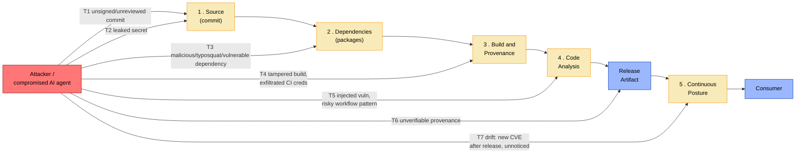

# SSCS Bootstrapper (`sscsb`)

[](https://github.com/p4gs/sscs-bootstrapper/actions/workflows/ci.yml)
[](https://github.com/p4gs/sscs-bootstrapper/actions/workflows/codeql.yml)
[](https://github.com/p4gs/sscs-bootstrapper/actions/workflows/sast-opengrep.yml)
[](https://github.com/p4gs/sscs-bootstrapper/actions/workflows/vuln-scan.yml)
[](https://github.com/p4gs/sscs-bootstrapper/actions/workflows/secrets-scan.yml)
[](https://github.com/p4gs/sscs-bootstrapper/actions/workflows/sbom.yml)
[](https://securityscorecards.dev/viewer/?uri=github.com/p4gs/sscs-bootstrapper)
[](https://slsa.dev/spec/v1.0/levels#build-l3)
[](https://docs.renovatebot.com/)

> `sscsb` now dogfoods its own generated output: `.github/workflows/`,
> `.sscsb/`, `.gitleaks.toml`, `.trufflehog.yaml`, and `renovate.json5` are
> committed, not gitignored, so every badge above tracks a workflow that
> actually runs in *this* repo's GitHub Actions on the default branch — not a
> static claim. They read pending/blank until this change reaches `main`, then
> self-populate from real runs. For the live local picture at any commit, run
> `sscsb verify` / `sscsb report` directly.

Software supply chain security for solo developers and small teams who write code
with AI — bootstrapped into a git repository in one command.

`sscsb` **orchestrates** best-in-class tools. It does not reimplement them. It
detects what you have, configures it, invokes it, parses its output, and gates on
the result. TruffleHog and Gitleaks find the secrets. Syft builds the SBOM. Trivy
and OSV-Scanner find the vulnerabilities. Cosign signs. slsa-verifier verifies.
`sscsb` is the policy engine and the glue, and it is honest about which of those
tools are actually present on your machine.

```
sscsb init      # config, hooks, policies, SHA-pinned CI templates
sscsb status    # every control: enabled? tool installed?
sscsb verify    # prove each enabled control actually works, here, now
sscsb report    # control → SLSA / SSDF / CRA coverage
```

## Why this exists

The threat model changed. An AI agent can add a dependency you have never heard
of, paste a credential into a config file, or write a `curl … | sh` install step —
in a commit that looks exactly like every other commit. The controls that catch
this already exist and are excellent. Wiring them together correctly — pinned, least-privilege,
fail-closed, verified — is the part nobody has time for.

That wiring is what this is.

Three ideas run through the whole design:

**Humans, CI, and AI never share a key.** Every signing identity is classified,
and only `human`-class identities may sign a commit that lands on a protected
branch. The gate keys on the signer's **class**, not on presence in
`allowed_signers`: with `agent-signing` off (the default) an AI-class key is not
emitted into that file at all, and with it on the key *is* emitted — deliberately,
so an agent's commit verifies as a genuine agent signature on a feature branch.
Either way the protected-branch answer is the same. An AI can draft anything; it
cannot land it.

**Every control is toggleable, and off means off.** One `.sscsb/config.toml`,
generated from the control registry itself, so the config and the code cannot
drift apart. Secure defaults on. If you disable a control, its code does not run.

**A missing tool degrades loudly, never silently.** If Trivy isn't installed,
`sscsb verify` says so, tells you the pinned version and how to install it, and
reports `DEGRADED` — it does not quietly pass. Nothing here claims to protect you
with a tool that isn't there.

## Threat & Control Model

Kept deliberately high level — SDLC-stage threats, not individual MITRE ATT&CK
techniques. Every arrow below maps to one of the five phases above; every
control listed is a real, `verify`-able check, not an aspiration.



| ID | Threat | Stage | Example | `sscsb` control | Phase |
|----|--------|-------|---------|------------------|-------|
| T1 | Unsigned or unreviewed commit lands on a protected branch | Source | An attacker — or a compromised AI agent — pushes a commit no human ever reviewed or cryptographically attested | Hardware-backed, human-only commit signing (AI keys are refused, not just discouraged); branch protection audit; AI-provenance commit trailers | 1 |
| T2 | Secret or credential committed to source | Source | An API key gets pasted into a config file and committed | Pre-commit + pre-push secret blocking (TruffleHog + Gitleaks) | 1 |
| T3 | Malicious, typosquatted, or known-vulnerable dependency introduced | Dependencies | An AI agent (or a human) adds a package one edit away from a popular name, or one with an unpatched CVE | SBOM (Syft); vulnerability scanning (Trivy + OSV-Scanner V2); package-trust checks (does it exist, is it a look-alike, did a human approve it); Renovate with digest pinning | 2 |
| T4 | Build process tampered with, or CI credentials exfiltrated | Build | A malicious build step alters what's actually compiled, or a workflow leaks a long-lived cloud credential | Harden-Runner egress control on every job; short-lived credentials (Octo STS); every CI template SHA-pinned to a 40-char commit digest | 1 & 3 |
| T5 | Vulnerability injected into first-party code, or a risky Actions pattern shipped | Code | A command-injection bug lands in application code; a workflow misuses `pull_request_target` against untrusted input | OpenGrep SAST (Semgrep selectable) in pre-commit and CI; CodeQL on PRs and default branch; workflow auditing for `pull_request_target` misuse, credential persistence, secret echo | 4 |
| T6 | Released artifact's provenance can't be verified — no proof of what built it, or from which commit | Build → Release | A binary is downloaded with nothing to confirm it came from the claimed pipeline and source | Keyless signing (Cosign/Fulcio/Rekor); SLSA Build L3 provenance via the official generator, checked with `slsa-verifier` before anything is promoted | 3 |
| T7 | A shipped artifact becomes vulnerable after release and the drift goes unnoticed | Post-release | A CVE is disclosed in a dependency months after release; nobody re-scans what's already out | Dependency-Track continuous SBOM management; GUAC supply-chain graph; OpenVEX so "not exploitable" is an auditable, first-class answer | 5 |

## Install

```sh
cargo build --release
install -m 0755 target/release/sscsb /usr/local/bin/sscsb
```

Then, in any git repository:

```sh
sscsb init
sscsb deps baseline     # bless the dependencies you already have
sscsb verify
```

`sscsb init` is idempotent: it writes what's missing and keeps what exists. Re-run
it after an upgrade; it will not clobber your edits.

External tools are **pinned** — `sscsb tools` prints the exact version `sscsb`
expects and where each one was found. Nothing installs `latest`, and nothing is
installed behind your back.

## The five phases

Each phase is a coherent layer, and each is independently useful. Full detail —
what each control does, which tool backs it, how it fails, how to turn it off — is
in the per-phase docs.

| Phase | What it gets you | Docs |
|-------|------------------|------|
| **1 — Commit integrity** | Secrets blocked pre-commit and pre-push. Hardware-backed, human-only signing enforced on protected branches. Branch protection checked. Actions audited for mutable refs and over-broad permissions. AI-provenance commit trailers, with extra gates when AI adds a dependency or a shell command. | [docs/phase-1.md](docs/phase-1.md) |
| **2 — Know your dependencies** | CycloneDX SBOMs (Syft). Vulnerability scanning (Trivy + OSV-Scanner V2). Scorecard. Renovate with digest pinning. Package-trust: does this package *exist*, is it one edit away from a popular name, did a human approve it? Endpoint exposure (Bumblebee): is a known-compromised package, MCP server, editor extension or agent skill already installed on this machine? | [docs/phase-2.md](docs/phase-2.md) |
| **3 — Provenance** | Keyless signing (Cosign/Fulcio/Rekor). SBOM and provenance attestations bound to artifact digests. SLSA Build L3 provenance via the official generator, verified with slsa-verifier before anything is promoted. GitHub-native build-provenance and SBOM attestations, verifiable with nothing but `gh`. Short-lived credentials (Octo STS). Harden-Runner on every job. | [docs/phase-3.md](docs/phase-3.md) |
| **4 — Code analysis** | OpenGrep SAST by default (Semgrep selectable), in pre-commit and CI. CodeQL on PRs and the default branch. Extended workflow auditing: `pull_request_target` misuse, credential persistence, secret echo, known-risky actions. | [docs/phase-4.md](docs/phase-4.md) |
| **5 — Continuous posture** | Dependency-Track for continuous SBOM management. GUAC for the supply-chain graph. OpenVEX so "not exploitable" is a first-class, auditable answer instead of a muted alert. A machine-readable control → SLSA/SSDF/CRA map behind `sscsb report`. | [docs/phase-5.md](docs/phase-5.md) |

Two more docs cover the parts people get wrong:

- **[docs/signing.md](docs/signing.md)** — YubiKey / `ed25519-sk` setup, the
  human/CI/AI key separation, and the WSL2 USB problem (and its fixes).
- **[docs/ai-provenance.md](docs/ai-provenance.md)** — commit trailers, the AI
  dependency and shell-command gates, and cryptographic receipts.
- **[docs/example-walkthrough.md](docs/example-walkthrough.md)** — a complete
  bootstrap on a fresh repo, with the real terminal output, including the hooks
  actually blocking a planted secret and an unsigned protected-branch commit.
- **[docs/qa-corpus-2026-08.md](docs/qa-corpus-2026-08.md)** — what happened
  when `sscsb` was run against twenty other repositories across two orgs, what
  that surfaced, and what the fixes measurably changed.

## Controls

44 controls, each with an id you can `enable`, `disable`, and `verify`:

```sh
sscsb status                      # what's on, what's installed
sscsb disable grype               # off means off — the code will not run
sscsb enable dependency-track
sscsb verify secrets commit-signing
sscsb verify --strict             # DEGRADED (missing tool) also exits non-zero
```

Secure defaults are on. Off by default are the ones that need infrastructure you
may not have (Dependency-Track, GUAC, ORAS), a paid or unreleased tool
(Sighthound, Socket), or that overlap something already on (Grype duplicates
Trivy for most people; Witness overlaps the SLSA generator).

## CI templates

`sscsb init` installs workflow templates into `.github/workflows/`, one per
enabled control that has a CI half. They are **SHA-pinned to 40-character commit
digests**, least-privilege (`permissions:` on every job, `contents: read` by
default), and every job runs Harden-Runner.

There is exactly one action that is *not* SHA-pinned:
`slsa-framework/slsa-github-generator`, which **must** be referenced by tag —
that is a requirement of its own trust model, and slsa-verifier validates the
builder ref. The exception is called out in the template and encoded in the
auditor as a single named exception rather than a general hole.

`sscsb` audits its own templates: a test asserts that **every** shipped workflow
passes `sscsb`'s own Actions audit. The tool that tells you to pin your actions
cannot ship an unpinned one.

## Verification, and what "verified" means here

`sscsb verify` runs each enabled control against the actual repository and reports
one of:

| Outcome | Meaning |
|---------|---------|
| `PASS` | The control is present and demonstrably working. |
| `FAIL` | The control is on, the tooling is there, and the repository does not satisfy it. |
| `DEGRADED` | The control is on, and the check **could not be performed** — so its posture is unknown, not fine. A missing tool is the common cause, and it tells you which one at which pinned version, but it is not the only one: no GitHub remote, an empty signer policy, or an incomplete setup all degrade with every tool present. Under `--strict` this exits non-zero. |
| `disabled` | You turned it off. It did not run. (Rendered lowercase, unlike every other verdict — anything matching on these strings has to special-case it.) |
| `INFO` | Reported for context; not a gate. |

There are no TODO stubs, no mock integrations, and no control that claims a tool
works without running it. Where a tool is absent, `sscsb` says so.

## Platforms

macOS, Linux, and WSL. The hooks are POSIX shell shims that delegate to the Rust
binary, so they work under git's own shell everywhere, including Git for Windows.
The one genuine platform limitation is hardware-key signing under WSL2, which
cannot reach USB FIDO2 devices directly — [docs/signing.md](docs/signing.md)
covers both workarounds.

## Navigating the code

`openwiki/` is a generated, evidence-grounded wiki over this repository — 41 pages
organised by what each control does at runtime rather than by source directory. Every
material claim in it cites the narrowest line range that establishes it, so a page is
checkable against the code rather than merely readable.

Start at [`openwiki/quickstart.md`](openwiki/quickstart.md). Three pages carry most of
the load:

- [The control registry and the verdict contract](openwiki/control-model/registry-and-outcomes.md)
  — the five verdicts, why `DEGRADED` is not `PASS`, and how verdicts become exit codes.
- [Process execution and the tool exit-code contract](openwiki/runtime/process-execution.md)
  — why a killed scanner must not read as a clean one, and the argument-injection guard on `git`.
- [Signer policy](openwiki/commit-integrity/signer-policy.md) and
  [the server-side policy gate](openwiki/commit-integrity/server-side-policy-gate.md)
  — the two halves of the AI-cannot-sign invariant, and why only one of them holds
  against a determined actor.

## Development

```sh
cargo build --release
cargo test               # unit + integration + library + tool-orchestration suites
cargo clippy --all-targets -- -D warnings
cargo fmt --check
cargo llvm-cov --ignore-filename-regex '(main\.rs|cli\.rs)'   # gate: 95% lines / 94% functions (see ci.yml)
```

The suites run the **real tools** where they are installed (a real `slsa-verifier`
verification against a real signed release artifact, a real OpenGrep scan, real
Gitleaks and TruffleHog runs against a planted secret) and exercise the
degrade paths by masking `PATH` where they are not.

`main.rs` and `cli.rs` are excluded from the coverage floor: they are argument
parsing and printing over library functions that are themselves covered. Every
control's logic lives in the library, including `sscsb init` itself.

No secret-shaped string exists anywhere in this repository's history. The test
that proves the hooks block a planted credential constructs that credential at
runtime, by concatenation. The hooks are run against this repository, by this
repository's CI.
